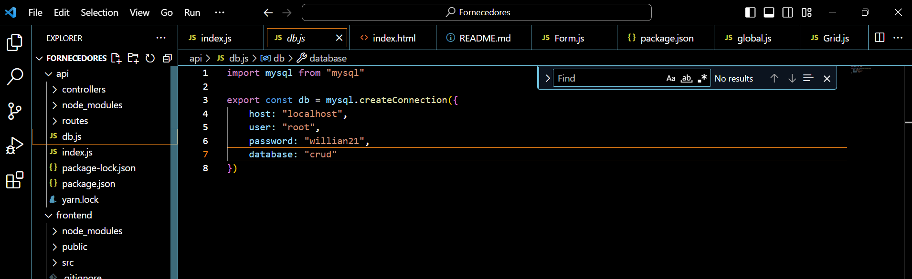

Este é um  Sistema de Cadastro, em que se é possível armazenar dados que controlam os
fornecedores de uma empresa fictícia. Foi feito para concorrer à uma vaga de estágio.
Primeiro de tudo, criei o banco de dados através do MySQL, 

Após criar o Banco de dados, foi criado a parte do back-end e front-end, no qual este foi o resultado:

Nesta parte, após um Fornecedor ser criado, aparece a mensagem dizendo que ele foi criado com sucesso:

Nesta outra parte, quando se remove um cadastro, aparece a mensagem que o mesmo foi excluído com sucesso:

Nesta terceira etapa, pode-se editar um fornecedor já cadastrado:

Na última etapa, nota-se que não é permitido o cadastro de um fornecedor sem preencher todos os campos ou com o campo de e-mail incompleto:

Conexão com o Banco de Dados:

GET,POST,PUT,DELETE:

Muito Obrigado! 

